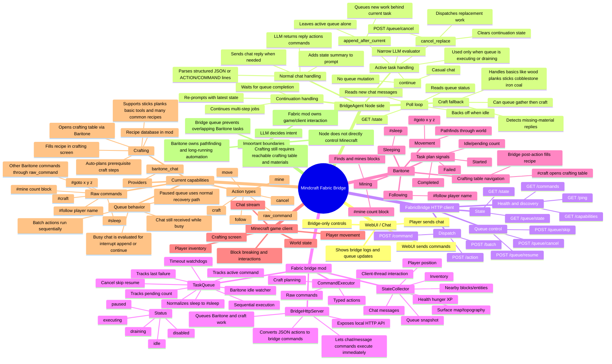

# Fabric Bridge + Baritone Mindmap

## Short Flow

1. A player chats or the WebUI sends a message.
2. `BridgeAgent` polls Fabric state and decides whether the queue is idle or active.
3. If idle, the normal planning prompt can create replies, actions, and commands.
4. If active, the narrow evaluator chooses `continue`, `cancel_replace`, or `append_after_current`.
5. `FabricBridge` sends work over HTTP to the Fabric mod.
6. `BridgeHttpServer` accepts commands/actions and hands queued work to `TaskQueue`.
7. `TaskQueue` runs one task at a time through `CommandExecutor`.
8. `CommandExecutor` either calls Baritone commands or performs client-side actions like crafting.
9. `StateCollector` reports chat, state, queue status, and failures back to Node.

